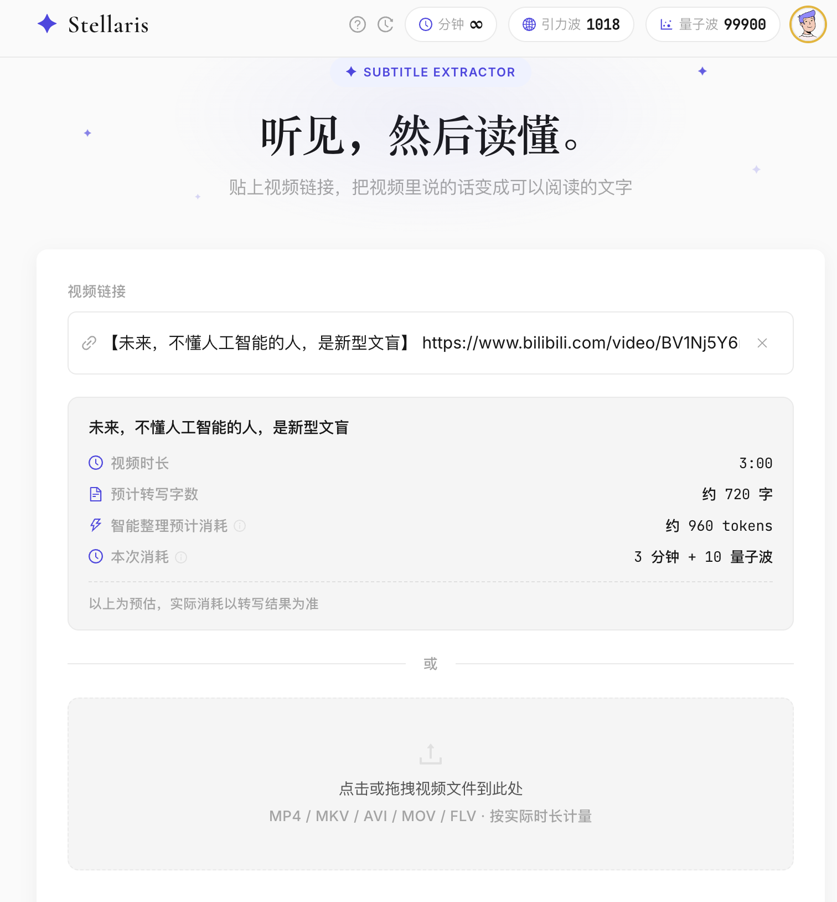
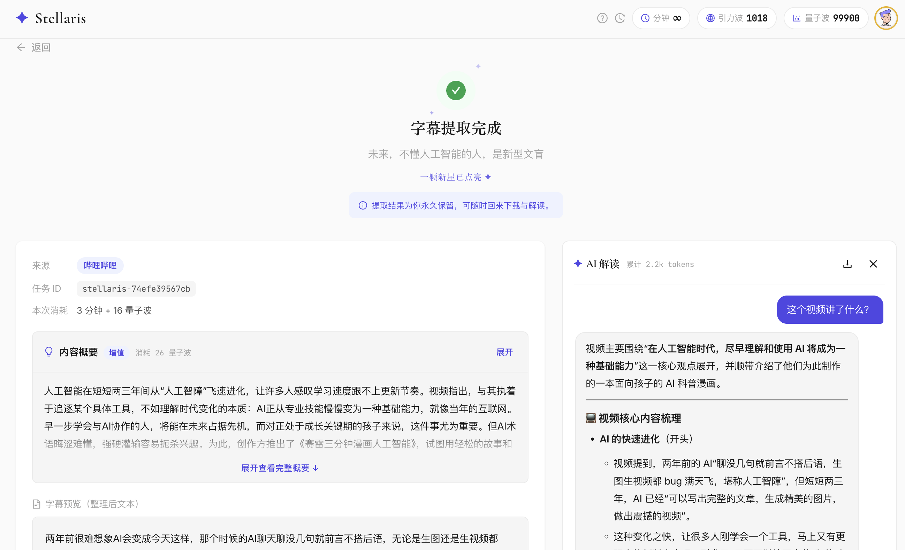
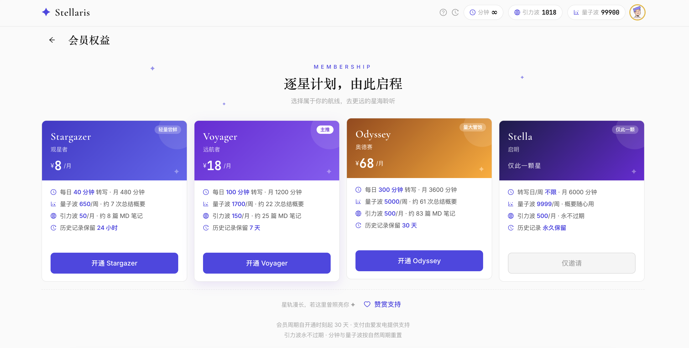
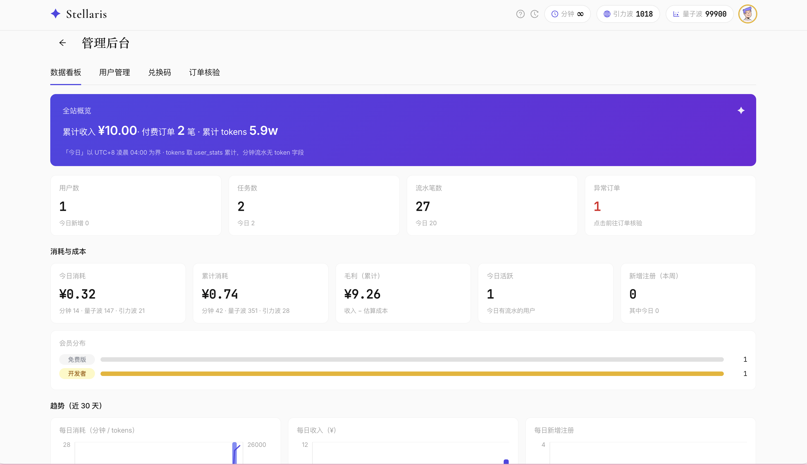

<p align="center">
  
</p>

<h1 align="center">Stellaris</h1>

<p align="center">
  <strong>Turning voices into words you can read.</strong><br/>
  视频字幕提取 · AI 内容理解 · 三层货币计费的完整产品
</p>

<p align="center">
  
  
  
  
  
  
</p>

---

## ✦ About

Stellaris is a full-featured subtitle extraction & content-understanding web app. Drop a **video link** (Bilibili / 小红书 / more) or **upload a file** — Stellaris pulls platform captions when available or transcribes audio with cloud ASR, then lets an LLM segment, summarize, structure and even *discuss* the content with you.

Built around a **three-currency billing system** and a **membership program** (via 爱发电), with history retention, redeem codes and a full admin dashboard.

### The Name

**Stellaris** — *of the stars*. Audio is stellar matter; each extraction leaves a trail of light — 我们叫它「星轨」。

---

## ✨ Features

### 🎬 Extraction
- **Multi-platform**: Bilibili (official API direct-connect, anti-412) / 小红书 & other sites (yt-dlp) / local file upload
- **Cloud ASR**: Xiaomi Mimo `mimo-v2.5-asr`, automatic chunking for videos of any length
- **CC subtitle fallback**: platform captions fetched first when available
- **Smart degradation**: graceful fallback when quantum balance runs low

| Platform | Method | Notes |
|----------|--------|-------|
| 哔哩哔哩 | Official API direct | Stable, anti-412 resistant |
| 小红书 | yt-dlp | Video notes |
| 本地上传 | FFmpeg | MP4 / MKV / AVI … |

### 🤖 AI Layer (DeepSeek)
- **Semantic segmentation** — raw transcript → readable paragraphs（默认开启）
- **Summary** — one-click content digest（概述 + 要点）
- **Markdown notes** — structured, downloadable `.md`
- **AI Chat** — multi-turn Q&A over the subtitle, SSE streaming, prefix-cache friendly

### 👤 Accounts & Billing
- Email + UID dual login, password & code channels, Turnstile protection
- **Three currencies** — every operation is metered, estimated, and settled honestly:

| Currency | Unit | For | Cycle |
|----------|------|-----|-------|
| ⏱ Minutes | 视频时长 | ASR 转写 | 日/周/月自然周期重置 |
| 🌊 量子波 | 1 = 100 tokens | 智能分段 · 总结概要 | 每周重发 + 永久活动钱包 |
| 💫 引力波 | 1 = 500 tokens | MD 笔记 · AI 解读 | 永不过期 |

- Transparent metering: pre-estimate, post-settlement, 40% round-down forgiveness
- Consumption ledger with dual-wallet breakdown — every wave is traceable
- History retention by tier: free 1h → up to 30d, audio deleted right after ASR

### 💎 Membership (爱发电)
| Tier | Price | Highlights |
|------|-------|-----------|
| **Stargazer** 观星者 | ¥8/mo | 480 min/mo · 650 量子波/周 · 24h history |
| **Voyager** 远航者 | ¥18/mo | 1200 min/mo · 1700 量子波/周 · 7d history |
| **Odyssey** 奥德赛 | ¥68/mo | 3600 min/mo · 5000 量子波/周 · 30d history |

- Webhook auto-fulfillment (RSA-verified, idempotent), redeem codes, tier-based history retention
- Cross-tier purchase lock · celebration on arrival ✦

### 🛡 Admin Dashboard (is_admin only)
- Metrics: users / tasks / tokens / revenue / **cost & margin estimation** / 30-day trends (recharts)
- User management: search, balance adjust, tier grant/revoke — all behind a 6-digit PIN
- Redeem code studio (custom codes incl. invitation tier), order review & manual fulfillment

### 🖼 Screenshots

<p align="center">
  <br/>
  <sub>首页 · 贴上链接，预估一目了然</sub>
</p>

<p align="center">
  <br/>
  <sub>结果页 · 字幕、概要、AI 解读同屏</sub>
</p>

<p align="center">
  <br/>
  <sub>逐星计划 · 四档会员卡</sub>
</p>

<p align="center">
  <br/>
  <sub>管理看板 · 数据、成本、趋势一页尽览（仅开发者）</sub>
</p>

---

## 🗺 Roadmap

- [x] Multi-platform extraction & cloud ASR
- [x] AI understanding layer (segment / summary / MD / chat)
- [x] Accounts & three-currency billing
- [x] Membership via 爱发电 (auto-fulfillment)
- [x] Admin dashboard with trends & cost estimation
- [ ] Annual plans & more member perks
- [ ] More platforms & batch processing

---

## ❓ FAQ

**为什么要注册？**
未登录每日可体验 10 分钟基础转写；注册解锁每日 30 分钟 + 量子波周赠 + 引力波注册礼 + 历史记录。

**额度怎么算？**
提交前预估、完成后按真实用量结算，零头不足 40% 免单；失败操作零扣费。每笔消耗都可在「消耗记录」里查到。

**数据安全吗？**
任务数据按档位时限自动清理（免费 1 小时起），音频转写后即删，只留文本；协议与隐私政策在应用内可查。

---

## 🛠 Tech Stack

| Layer | Technology |
|-------|-----------|
| Frontend | React 18 · Vite · Ant Design 5 · Starlight Design System (Cormorant Garamond / Inter) |
| Backend | Python 3.12+ · FastAPI · SQLAlchemy 2.0 (aiosqlite) · SQLite |
| ASR | [Xiaomi Mimo](https://platform.mimo.com.cn/) `mimo-v2.5-asr` |
| LLM | DeepSeek (OpenAI-compatible) — segmentation / summary / markdown / chat |
| Media | FFmpeg · yt-dlp |
| Auth | JWT · bcrypt · Cloudflare Turnstile · Resend |
| Payment | 爱发电 Webhook (RSA-SHA256) |
| Deploy | Single-service Dockerfile · Zeabur (Volume persistence, gzip, immutable assets) |

---

## 🔁 Pipeline

```
Input (URL / File)
   │  ① Download / extract audio (B站 API | yt-dlp | FFmpeg)
   ▼  ② ASR transcribe (auto-chunking) ── audio deleted right after
   │  ③ LLM semantic segmentation (量子波)
   ▼  ④ Export .srt + .txt ── history retained per tier (1h → 30d)
   └─→ ⑤ On demand: Summary (量子波) · MD notes (引力波) · AI Chat (引力波)
```

---

## 🚀 Quick Start

### Prerequisites

- **Python 3.12+** · **Node.js 18+** · **FFmpeg** (in PATH)
- API keys: [Xiaomi Mimo](https://platform.mimo.com.cn/) · [DeepSeek](https://platform.deepseek.com/)

### 1. Configure

```bash
git clone https://github.com/Yuntian-Liu/Stellaris.git
cd Stellaris/backend
cp .env.example .env      # fill MIMO_API_KEY / LLM_API_KEY / auth keys
```

### 2. Backend

```bash
cd backend
python -m venv .venv && source .venv/bin/activate
pip install -r requirements.txt
python -m uvicorn main:app --port 8000
```

### 3. Frontend

```bash
cd frontend
npm install
npm run dev          # → http://localhost:3000 (proxied to :8000)
```

### 4. Use

Paste a video link → confirm estimate → watch it transcribe → download SRT/TXT, or open AI chat on the right.

---

## 🐳 Deploy

Single-service Dockerfile (frontend build → backend static serving on port 8000). On Zeabur:

- Mount a Volume at `/app/storage` (SQLite + task files persist across deploys)
- Set env vars (API keys, auth secrets, 爱发电 webhook config)
- Schema migrations self-heal on startup (`_ensure_columns`)

---

## 💖 Support

If Stellaris saved you hours, consider supporting on **爱发电**:
**[ifdian.net/a/ytunx](https://ifdian.net/a/ytunx)** — memberships or a cup of coffee ☕

Every bit of support becomes a small cell of electricity on the server bill ⚡

---

## 🙏 Acknowledgments

- **Xiaomi Mimo** — speech recognition
- **DeepSeek** — content understanding
- **yt-dlp / FFmpeg** — media plumbing
- **Ant Design** — UI components
- **爱发电** — membership & payment infrastructure
- Apple / Vercel / Claude — design inspiration for Starlight

---

## 📜 License

MIT License — Copyright (c) 2025-2026 Yuntian Liu (碳碳四键)

---

<p align="center">
  <sub>Built with ♥ by <a href="https://github.com/Yuntian-Liu">Yuntian Liu</a> · 每一段声音，都是一颗星 ✦</sub>
</p>
