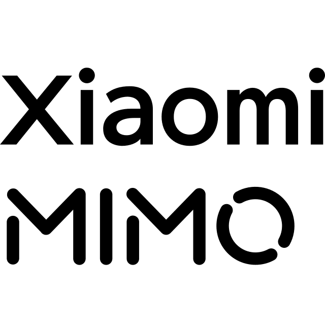

<p align="center">
  
</p>

<h1 align="center">Stellaris</h1>

<p align="center">
  <strong>Turning voices into words you can read.</strong>
</p>

<p align="center">
  <a href="#-features">Features</a> •
  <a href="#-tech-stack">Tech Stack</a> •
  <a href="-quick-start">Quick Start</a> •
  <a href="#-pipeline">Pipeline</a> •
  <a href="#-license">License</a>
</p>

---

## ✦ About

Stellaris is a subtitle extraction web app that converts video audio into readable text. Drop a **Bilibili link** or upload a video file — Stellaris pulls existing captions when available, or transcribes the audio from scratch using state-of-the-art ASR.

Ships clean `.srt` and `.txt` exports.

### The Name

**Stellaris** — *of the stars*. Audio is stellar matter; each word is light captured in text.

---

## ✨ Features

| Feature | Description |
|---------|-------------|
| 🎬 **Bilibili Integration** | Paste a B站 URL — auto-downloads and extracts audio via `yt-dlp` |
| 📁 **File Upload** | Upload any video file (MP4, MKV, AVI…) directly |
| 🎙️ **Cloud ASR** | Powered by [Xiaomi Mimo](https://platform.mimo.com.cn/) (`mimo-v2.5-asr`) — automatic speech recognition with timestamped segments |
| 📝 **CC Subtitle Fallback** | Fetches platform-provided closed captions when available (optional SESSDATA) |
| 📐 **Long Audio Support** | Automatic chunking for videos of any length — no 8192 token wall |
| 💾 **Dual Export** | Download as **SRT** (subtitle-ready) or **TXT** (plain text) |
| 🎨 **Starlight UI** | Clean, minimal interface — Vercel precision × Linear surfaces × Apple simplicity |

---

## 🛠 Tech Stack

```
┌─────────────────────────────────────┐
│            Frontend                 │
│  React 18 · Vite · Ant Design 6.x  │
│  Starlight Design System            │
└──────────────┬──────────────────────┘
               │ REST API
┌──────────────▼──────────────────────┐
│            Backend                  │
│  Python 3.11+ · FastAPI             │
├─────────────────────────────────────┤
│  Pipeline                           │
│  yt-dlp → FFmpeg → Mimo ASR         │
│  SRT / TXT export                   │
└─────────────────────────────────────┘
```

| Layer | Technology |
|-------|-----------|
| Frontend | React 18, Vite, Ant Design 6.x, Google Fonts (Cormorant Garamond / Inter) |
| Backend | Python 3.11+, FastAPI, OpenAI SDK (Mimo-compatible) |
| Audio | FFmpeg (compression & chunking), yt-dlp (Bilibili download) |
| ASR | [Xiaomi Mimo Platform](https://platform.mimo.com.cn/) `mimo-v2.5-asr` model |

---

## 🚀 Quick Start

### Prerequisites

- **Python 3.11+** with pip
- **Node.js 18+** (for frontend dev)
- **FFmpeg** — [download](https://ffmpeg.org/download.html) or `winget install Gyan.FFmpeg`
- **yt-dlp** — `pip install yt-dlp`
- **Mimo API Key** — register at [Xiaomi Mimo Platform](https://platform.mimo.com.cn/)

### 1. Clone & Configure

```bash
git clone https://github.com/YuntianLiu/Stellaris.git
cd Stellaris/backend

# Copy environment template
cp .env.example .env
# Edit .env and fill in your MIMO_API_KEY
```

`.env` configuration:

```env
MIMO_API_KEY=sk-your-mimo-api-key-here
BILIBILI_SESSDATA=                    # optional, for CC subtitles
```

### 2. Backend

```bash
cd backend
pip install -r requirements.txt
python -m uvicorn main:app --host 0.0.0.0 --port 8000
# → http://localhost:8000/health
```

### 3. Frontend

```bash
cd frontend
npm install
npm run dev
# → http://localhost:3004 (proxied to backend :8000)
```

### 4. Use

1. Open `http://localhost:3004`
2. Paste a Bilibili URL **or** drag & drop a video file
3. Click **Extract Subtitles**
4. Preview results → Download **SRT** or **TXT**

---

## 🔁 Pipeline

```
Input (URL / File)
        │
        ▼
  ┌─────────────┐
  │  1. Download │  ← yt-dlp (URL) or FFmpeg extract (file)
  │   + Extract  │
  └──────┬──────┘
         │ audio.mp3
         ▼
  ┌─────────────┐
  │ 2. Compress  │  ← FFmpeg: 16kHz mono 64k (if >10MB)
  └──────┬──────┘
         │ compressed.mp3
         ▼
  ┌─────────────┐
  │ 3. Split     │  ← ~25s chunks (if duration >20s)
  └──────┬──────┘
         │ chunk_001.mp3, chunk_002.mp3, ...
         ▼
  ┌─────────────┐
  │ 4. Transcribe│  ← Mimo ASR (per chunk, with offset)
  └──────┬──────┘
         │ segments [{start, end, text}, ...]
         ▼
  ┌─────────────┐
  │ 5. Export    │  → output.srt + output.txt
  └─────────────┘
```

---

## 📁 Project Structure

```
Stellaris/
├── backend/
│   ├── main.py              # FastAPI app entry point
│   ├── config.py            # Global configuration & env loading
│   ├── models.py            # Pydantic request/response models
│   ├── utils.py             # Task ID generation, disk checks, cleanup
│   ├── requirements.txt     # Python dependencies
│   ├── .env.example         # Environment template
│   └── pipeline/
│       ├── __init__.py
│       ├── download.py      # Step 1: yt-dlp / FFmpeg audio extraction
│       ├── asr.py           # Step 2: Mimo ASR with chunking
│       ├── subtitle.py      # Step 2b: Bilibili CC subtitle fetch
│       └── export.py        # Step 3: SRT / TXT formatting & save
│
├── frontend/
│   ├── src/
│   │   ├── App.jsx          # Root component + Starlight design tokens
│   │   ├── main.jsx         # Entry point + AntD ConfigProvider
│   │   ├── hooks/api.js     # Backend API client
│   │   └── pages/
│   │       ├── HomePage.jsx      # Input form (URL + upload)
│   │       ├── ProgressPage.jsx  # Real-time progress tracking
│   │       └── ResultPage.jsx    # Preview + download
│   ├── index.html           # Google Fonts (Cormorant Garamond / Inter)
│   ├── public/favicon.svg
│   ├── package.json
│   └── vite.config.js      # Dev proxy :3004 → :8000
│
├── README.md
├── DEVELOPMENT.md           # Development notes & roadmap
└── .gitignore
```

---

## 🙏 Acknowledgments

<p align="center">
  
</p>

<p align="center">
  <strong>Speech recognition powered by</strong><br/>
  <a href="https://platform.mimo.com.cn/">Xiaomi Mimo Platform</a> · <code>mimo-v2.5-asr</code>
</p>
- **yt-dlp** — Reliable video/audio downloading from 1000+ sites.
- **FFmpeg** — Swiss-army knife for audio processing.
- **Ant Design** — Enterprise-grade UI components.
- **Vercel / Linear / Apple / Claude** — Design inspiration for the Starlight system.

---

## 📜 License

This project is licensed under the **MIT License**.

```
Copyright (c) 2025 Yuntian Liu (碳碳四键)

Permission is hereby granted, free of charge, to any person obtaining a copy
of this software and associated documentation files (the "Software"), to deal
in the Software without restriction, including without limitation the rights
to use, copy, modify, merge, publish, distribute, sublicense, and/or sell
copies of the Software, and to permit persons to whom the Software is
furnished to do so, subject to the following conditions:

The above copyright notice and this permission notice shall be included in all
copies or substantial portions of the Software.
```

---

<p align="center">
  <sub>Built with ♥ by <a href="https://github.com/YuntianLiu">Yuntian Liu</a> · Every star is a word collected.</sub>
</p>
